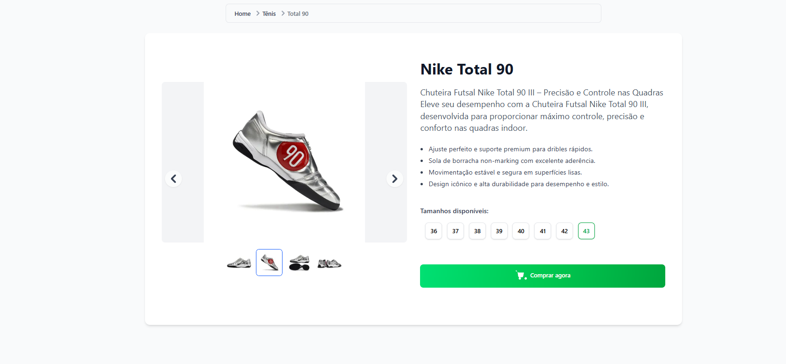

# Screenshots

Add screenshots of the product page here:



# Product Page – Running Shoes

Single page app for a men's running shoe product, featuring a modern, responsive layout and interactive UI.

## Tech Stack

- Next.js (React + TypeScript)
- Tailwind CSS

## Features

- Product image carousel
- Breadcrumb navigation
- Product details, highlights, and available sizes
- Selectable size cards with feedback
- Responsive design (mobile/tablet/desktop)
- Accessible and semantic HTML
- Animated buttons and hover effects

## Quick Start

```bash
npm install
npm run dev
```

Open [http://localhost:3000](http://localhost:3000) to view the page.

## Usage

- Browse product images, details, and sizes
- Select a size and click "Comprar agora" to simulate a purchase

## Notes about the breadcrumb

The breadcrumb component lives in `app/components/shared/breadcrumb` and is built to accept a flexible list of items, a custom Link component (for `next/link`), and an optional JSON-LD structured data injection for SEO. It supports truncation and accessibility attributes like `aria-current`.

---

Small project created as part of a UI challenge to build a product page for running shoes.
